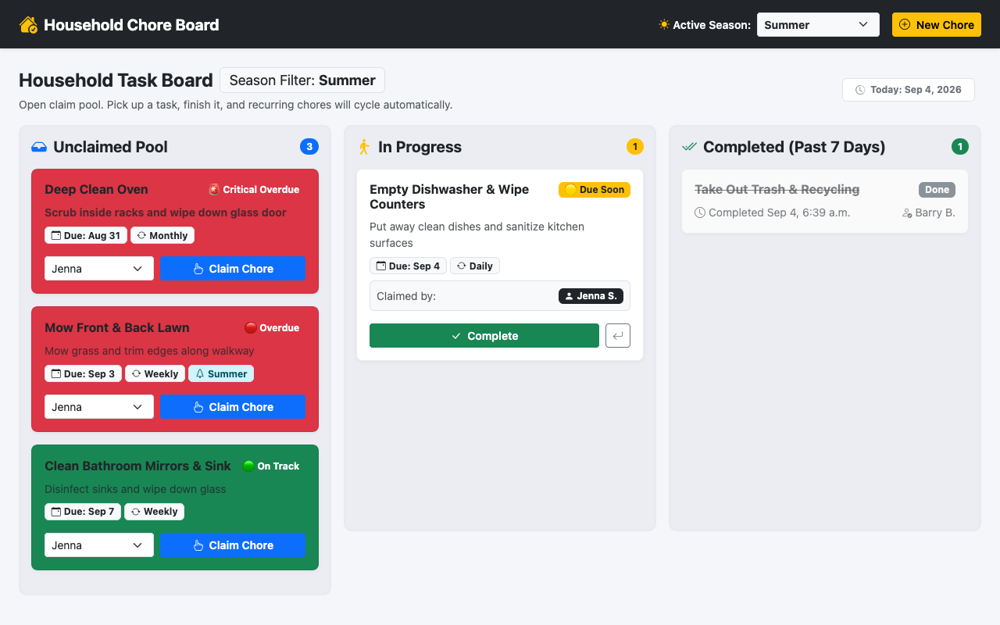

# Shared Household Chore System (Django)

A web-based household chore management application built with **Python & Django**. Designed for flexible household dynamics (roommates, couples, or families), the system features an open task pool where members claim chores on demand, automated deadline-driven visual urgency indicators, dynamic seasonal filtering (e.g., summer lawn care vs. winter snow removal), and automatic recurring task generation.

---

## 📸 Application Preview



---

## 🚀 Core Features

### 1. Open-Pool Kanban Claim Board
* **Visual Pipeline:** Tasks flow through three columns:
  * **Unclaimed Pool:** Open chores waiting to be picked up.
  * **In Progress:** Chores actively claimed by a household member.
  * **Completed (Past 7 Days):** Finished chores displayed with timestamp and member attribution.
* **One-Click Actions:** 
  * `✋ Claim Chore`: Assigns task to a member and moves it to *In Progress*.
  * `✅ Complete`: Marks the chore done, timestamps it, and triggers recurrence.
  * `↩ Release`: Sends an in-progress chore back to the unclaimed pool.

### 2. Deadline-Driven Visual Urgency Engine
Dynamic model properties calculate time-based urgency relative to deadlines, replacing nagging with clear visual indicators:
* `🟢 On Track`: More than 1 day remaining until deadline.
* `🟡 Due Soon`: Due today or tomorrow.
* `🔴 Overdue`: Past scheduled deadline.
* `🚨 Critical Overdue`: More than 3 days past deadline (pulsating visual alert).

### 3. Dynamic Seasonal Chore Filtering
* **Global Season Toggle:** Switch household season (`Spring`, `Summer`, `Fall`, `Winter`, or `All / Any`) from the navigation bar.
* **Smart Visibility:** Chores tagged with a specific season (e.g. lawn mowing in summer, snow shoveling in winter) appear when their season is active and remain hidden during off-seasons, while `Year-Round` tasks stay active continuously.

### 4. Automated Recurrence & History Archive
* Chores support intervals: `One-off`, `Daily`, `Weekly`, `Bi-Weekly`, `Monthly`, and `Seasonal`.
* Completing a recurring chore automatically spawns the next instance in the `Unclaimed Pool` with an updated `due_date`.
* Completed tasks persist in the database for tracking and accountability.

---

## 📁 Project Structure

```text
src/chores/
├── pyproject.toml              # uv project dependencies (Django 6.1)
├── manage.py                   # Django CLI management script
├── config/                     # Django project configuration
│   ├── settings.py             # Registered 'chores' in INSTALLED_APPS
│   ├── urls.py                 # Root URL routing
│   ├── wsgi.py
│   └── asgi.py
└── chores/                     # Core application
    ├── models.py               # HouseholdSettings & Chore models
    ├── views.py                # Kanban board and action endpoints
    ├── urls.py                 # App URL patterns
    ├── admin.py                # Django admin configuration
    ├── tests.py                # 13 automated unit tests
    └── templates/chores/
        ├── base.html           # Responsive Bootstrap 5 layout & season switcher
        └── board.html          # Kanban pipeline board
```

---

## 🛠️ Getting Started with `uv`

### 1. Prerequisites
Install `uv` (fast Python package and project manager):
```bash
curl -LsSf https://astral.sh/uv/install.sh | sh
```

### 2. Setup & Database Migrations
Navigate into `src/chores` and apply migrations:
```bash
cd src/chores
uv run python manage.py migrate
```

### 3. Seed Sample Household Data (Optional)
Populate the database with Jenna and Barry's household and sample chores across urgency tiers:
```bash
uv run python manage.py seed
```

### 4. Run Automated Tests
Run the complete test suite (models, urgency calculations, seasonality, and views):
```bash
uv run python manage.py test
```

### 5. Start the Development Server
```bash
uv run python manage.py runserver
```
Open your browser and navigate to:
```
http://127.0.0.1:8000/
```

### 6. Access Django Admin (Optional)
Create an admin superuser:
```bash
uv run python manage.py createsuperuser
```
Log in at `http://127.0.0.1:8000/admin/` to manage chores, household settings, and user accounts.
